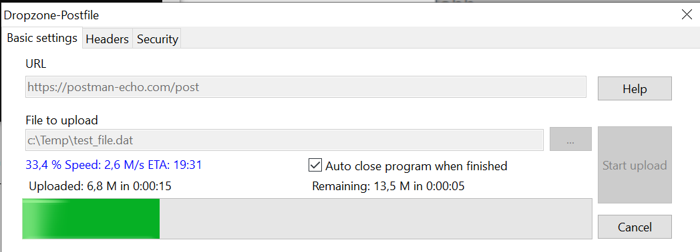
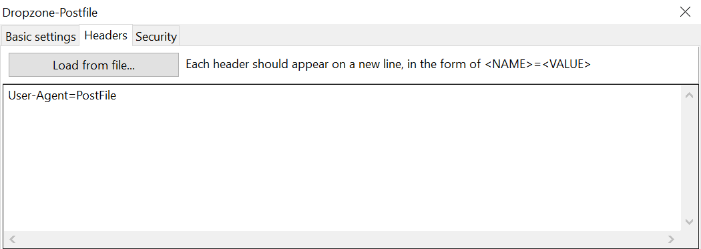
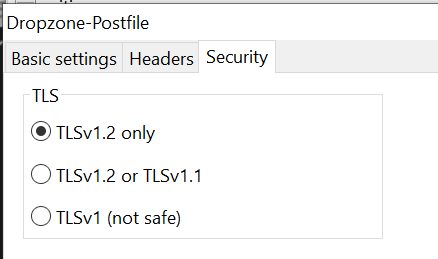

# dropzone-postfile

A simple GUI tool that can POST huge files to http servers. 

It is a portable application that can be parametrized from the command line, and it can POST huge files to http servers.
This tool works especially well with the dropzone-backup-server project ( see https://github.com/nagylzs/dropzone-backup-server ).

Advantages:

* Use simple http or https protocol for backing up files. 
* Can traverse multiple NATs and proxies (including most corporate proxies)
* Portable, single exe file without dependencies
* Does not require administrative rights

## Screenshots

## Command line options

	-h, --help

	   Display this help text

	-u --url URL

		Set the URL where the file should be posted. This should start with http:// or https://

	-f --file FILENAME

		The file that needs to be POST-ed to the server.

	-d --headers FILENAME

		Load HTTP headers from a file.

	-a --add-header NAMEVALUEPAIR

	   Add a header line. You must use it in this format:

			--add-header=HeaderName=HeaderValue

	   You can specify this option multiple times.

	--auto-start

		Automatically start uploading

	--auto-close

		Automatically close after the file was uploaded

	--title TITLE

	   Set the title of the main window

	--allow-tls-1.1

	   Allow TLSv1.1 (only TLS 1.2 is enabled by default).

	--allow-tls-1.0

	   Allow TLSv1.0 (only TLS 1.2 is enabled by default).

## Extras

In the extras directory, you will find an AutoIt script that can be configured to do the following:

* Compress a file (or files or directories) with 7-zip (and encrypt it with a password)
* Upload the archive to a dropzone-backup-server
* Delete the archive

